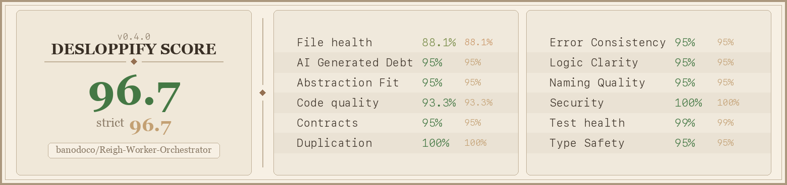

# Headless WGP Orchestrator

Manages [Reigh Workers](https://github.com/banodoco/Reigh-worker) on RunPod and API-based tasks on Fal and Wavespeed.

## Scorecard



## Services

- **gpu_orchestrator/** - Spawns, monitors, and terminates RunPod GPU workers based on task demand
- **api_orchestrator/** - Handles API-based tasks (fal.ai, Wavespeed, image processing)

## Deploy

```bash
./deploy_to_railway.sh          # Deploy both
./deploy_to_railway.sh --gpu    # GPU orchestrator only
./deploy_to_railway.sh --api    # API orchestrator only
```

## Debug

```bash
python scripts/debug.py task <task_id>      # Investigate a task
python scripts/debug.py worker <worker_id>  # Check worker status
python scripts/debug.py health              # System overview
python scripts/debug.py runpod              # Find orphaned pods
```

## Local Dev

```bash
cp env.example .env  # Fill in credentials
pip install -r api_orchestrator/requirements.txt
pip install -r gpu_orchestrator/requirements.txt
pip install -r requirements-dev.txt
python -m gpu_orchestrator.main continuous
```

## Worker Pool Contract

The GPU orchestrator uses one worker image for both WGP and VibeComfy. Route
selection is controlled by pool metadata and environment flags:

```bash
# WGP production pool
RUNPOD_CONTAINER_IMAGE=your_worker_image:latest
REIGH_BACKEND=wgp
REIGH_WORKER_PROFILE=1
REIGH_WORKER_POOL=gpu-wgp-production
REIGH_SELECTOR_NAMESPACE=production
REIGH_SELECTOR_VERSION=
REIGH_WORKER_CONTRACT_VERSION=1

# VibeComfy canary pool, same image
RUNPOD_CONTAINER_IMAGE=your_worker_image:latest
REIGH_BACKEND=vibecomfy
REIGH_WORKER_PROFILE=3
REIGH_WORKER_POOL=gpu-vibecomfy-canary
REIGH_SELECTOR_NAMESPACE=canary
REIGH_SELECTOR_VERSION=42
REIGH_WORKER_CONTRACT_VERSION=1
```

Warm-cache preload is route-aware and still skipped when the orchestrator sees
pending tasks. Configure it with either a direct model override or a manifest:

```bash
REIGH_WARM_CACHE_PRELOAD_MODEL=wan_2_2_i2v_lightning_baseline_2_2_2
REIGH_WARM_CACHE_CONFIG='{"routes":[{"backend":"wgp","profile":"1","preload_model":"wan_2_2_i2v_lightning_baseline_2_2_2"}]}'
REIGH_DISK_NEAR_FULL_PCT=90
```

Local resource pressure handling is also worker-enforced. When configured,
near-full disk suppresses new claims, emits quota-alert labels, sweeps eligible
artifact orphans and LoRA cache files, and blocks local ingest writes only after
cleanup cannot recover the required space:

```bash
REIGH_DISK_CLAIM_MIN_FREE_MB=1024
REIGH_DISK_WRITE_MIN_FREE_MB=1024
REIGH_DISK_WRITE_RESERVE_MB=512
REIGH_ARTIFACT_CLEANUP_PATHS=/workspace/reigh-worker/outputs:/workspace/reigh-worker/artifacts
REIGH_LORA_CACHE_MAX_BYTES=32212254720
REIGH_LORA_CACHE_MAX_FILES=64
REIGH_LORA_CACHE_MAX_AGE_SECONDS=2592000
```

## Test Quality

```bash
pytest -q
pytest --cov=api_orchestrator --cov=gpu_orchestrator --cov-report=term-missing -q
```
